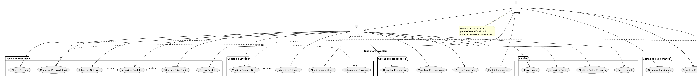
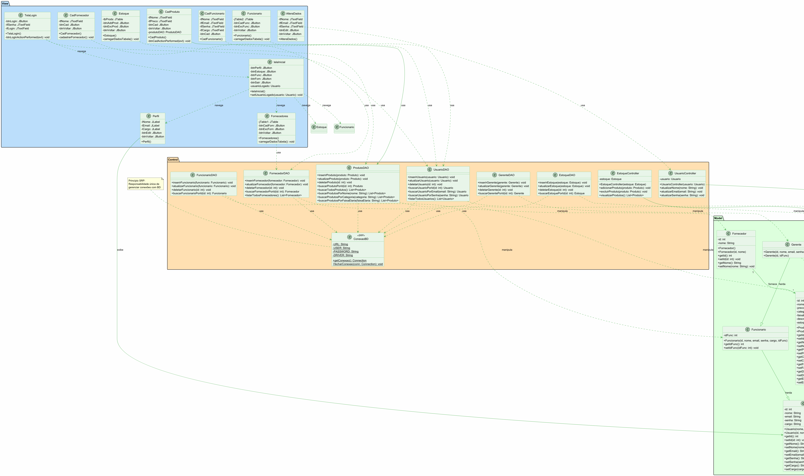

# Kids Store Inventory - Sistema de Estoque Infantil

### Desenvolvido por:
Lia

### Projeto de Programação Orientada a Objetos 
Sistema integrativo e educacional voltado para a gestão eficiente de estoque de **brinquedos e livros infantis**. Este projeto busca oferecer soluções práticas e inteligentes para resolver desafios comuns relacionados ao controle e otimização de inventários de produtos voltados para o público infantil. Através de uma abordagem orientada a objetos e seguindo os princípios SOLID, desenvolvemos uma plataforma robusta e intuitiva.

## Objetivo do Sistema:
O objetivo do sistema é oferecer uma solução abrangente para o gerenciamento de estoque de produtos infantis, facilitando e otimizando os processos relacionados ao controle de **brinquedos e livros educativos**, fornecedores especializados e gestão de inventário por faixa etária.

## Funcionalidades Principais:
1. **Cadastro de produtos infantis** - Registro de brinquedos e livros com informações específicas:
   - Categoria (Brinquedo ou Livro)
   - Faixa etária recomendada (0-2 anos, 3-5 anos, 6-8 anos, 9-12 anos, etc.)
   - Descrição detalhada do produto
   - Estoque mínimo para alertas
   - Preço

2. **Gestão de fornecedores especializados** - Cadastro de fornecedores de produtos infantis com controle de relacionamento produto-fornecedor.

3. **Controle de estoque inteligente** - Visualização e gerenciamento do inventário com:
   - Filtros por categoria (Brinquedos/Livros)
   - Busca por faixa etária
   - Alertas de estoque baixo
   - Controle de quantidade de produtos

4. **Gestão de usuários e permissões** - Sistema de login com diferentes níveis de acesso:
   - Funcionários: podem gerenciar produtos e estoque
   - Gerentes: possuem acesso completo incluindo gestão de funcionários e fornecedores

5. **Interface amigável** - Design intuitivo focado em facilitar a gestão do dia a dia de lojas de produtos infantis.

## Público-Alvo do Sistema:
O sistema é direcionado a **lojas especializadas em produtos infantis**, incluindo:
- Lojas de brinquedos educativos
- Livrarias infantis
- Lojas multimarcas de produtos para crianças
- Pequenos e médios estabelecimentos que precisam de controle eficiente de inventário

## Impacto do Sistema:
A implementação do sistema terá um impacto significativo na eficiência operacional das lojas de produtos infantis:
- Melhor controle sobre o estoque de brinquedos e livros
- Organização por faixa etária facilita atendimento aos clientes
- Redução de perdas e rupturas de estoque
- Gestão eficiente de fornecedores especializados
- Relatórios detalhados para tomada de decisões estratégicas
- Melhor experiência para os clientes ao encontrar produtos adequados para cada idade

## Princípios SOLID Aplicados:
- **SRP (Single Responsibility Principle)**: Cada classe tem uma única responsabilidade
- **OCP (Open/Closed Principle)**: Classes abertas para extensão, fechadas para modificação
- **LSP (Liskov Substitution Principle)**: Herança adequada entre Usuario, Funcionario e Gerente
- **ISP (Interface Segregation Principle)**: Interfaces específicas e coesas
- **DIP (Dependency Inversion Principle)**: Uso de abstrações e classe de conexão centralizada

## Requisitos Funcionais

| Identificador | Descrição | Prioridade |
|--|--|--| 
|RF01|Sistema deve permitir cadastro de produtos infantis (brinquedos e livros) com categoria e faixa etária |Alta|
|RF02|Usuário pode inserir/alterar produtos no Estoque |Alta| 
|RF03|Sistema deve permitir filtrar produtos por categoria (Brinquedo/Livro) |Alta|
|RF04|Sistema deve permitir filtrar produtos por faixa etária |Alta|
|RF05|Usuário pode inserir/alterar fornecedores de produtos infantis|Alta| 
|RF06|Alertas de estoque baixo baseados no estoque mínimo configurado|Alta| 
|RF07|Sistema deve calcular a disponibilidade de estoque de produtos infantis|Alta| 
|RF08|Listar estoque com informações de categoria e faixa etária |Alta| 
|RF09|Usuário pode visualizar lista de fornecedores |Média| 
|RF10|Gerente pode excluir/adicionar funcionários |Média| 
|RF11|Gerente pode excluir fornecedores e produtos |Média| 
|RF12|O usuário deve fazer login no sistema|Alta|
|RF13|Sistema deve exibir descrição detalhada dos produtos infantis|Média|

## Requisitos Não Funcionais

|Identificador|Descrição|Categoria|
|-|-|-|
|RNF01|Sistema funcionará em desktop (aplicação Java Swing)|Portabilidade|
|RNF02|Banco de dados MySQL para armazenamento de dados|Confiabilidade|
|RNF03|Interface amigável e intuitiva para facilitar uso|Usabilidade|
|RNF04|Aplicação dos princípios SOLID (SRP, OCP, LSP, ISP)|Manutenibilidade|
|RNF05|Arquitetura MVC (Model-View-Controller)|Manutenibilidade|

## Estrutura do Projeto (MVC)

### Model
- `Produto.java` - Representa produtos infantis (brinquedos e livros)
- `Estoque.java` - Gerencia o estoque de produtos
- `Fornecedor.java` - Representa fornecedores de produtos infantis
- `Usuario.java` - Usuário base do sistema
- `Funcionario.java` - Herda de Usuario, representa funcionários
- `Gerente.java` - Herda de Funcionario, possui permissões especiais

### View
- `TelaLogin.java` - Tela de autenticação
- `telaInicial.java` - Tela principal do sistema
- `CadProduto.java` - Cadastro de produtos infantis
- `CadFornecedor.java` - Cadastro de fornecedores
- `CadFuncionario.java` - Cadastro de funcionários
- `Estoque.java` - Visualização e gestão do estoque
- `Fornecedores.java` - Lista de fornecedores
- `Funcionario.java` - Gestão de funcionários
- `Perfil.java` - Perfil do usuário
- `AlteraDados.java` - Alteração de dados do usuário

### Control (Controller + DAO)
- `ConexaoBD.java` - **Classe de conexão centralizada com banco de dados**
- `ProdutoDAO.java` - Operações CRUD de Produto
- `EstoqueDAO.java` - Operações CRUD de Estoque
- `FornecedorDAO.java` - Operações CRUD de Fornecedor
- `UsuarioDAO.java` - Operações CRUD de Usuario
- `FuncionarioDAO.java` - Operações CRUD de Funcionario
- `GerenteDAO.java` - Operações CRUD de Gerente
- `UsuarioController.java` - Controlador de Usuario
- `EstoqueController.java` - Controlador de Estoque

### Database
- `kidstoreBD.sql` - **Script SQL atualizado com campos específicos para produtos infantis**

## Diagramas

### Diagrama de Casos de Uso

### Diagrama de Classes

## Tecnologias Utilizadas
- **Java** - Linguagem de programação
- **Java Swing** - Interface gráfica
- **MySQL** - Banco de dados
- **JDBC** - Conexão com banco de dados
- **Maven** - Gerenciamento de dependências

## Como Executar
1. Importar o banco de dados usando o script `DataBase/kidstoreBD.sql`
2. Configurar credenciais do MySQL na classe `Control/ConexaoBD.java` (se necessário)
3. Compilar e executar o projeto através do arquivo `pom.xml` (Maven)
4. Fazer login com as credenciais cadastradas no banco de dados (ex: `maria@kidstore.com` / `123456`)

## Contribuição 
Contribuições são bem-vindas! Sinta-se à vontade para abrir uma issue para reportar bugs ou solicitar novas funcionalidades. Pull requests também são apreciados.
